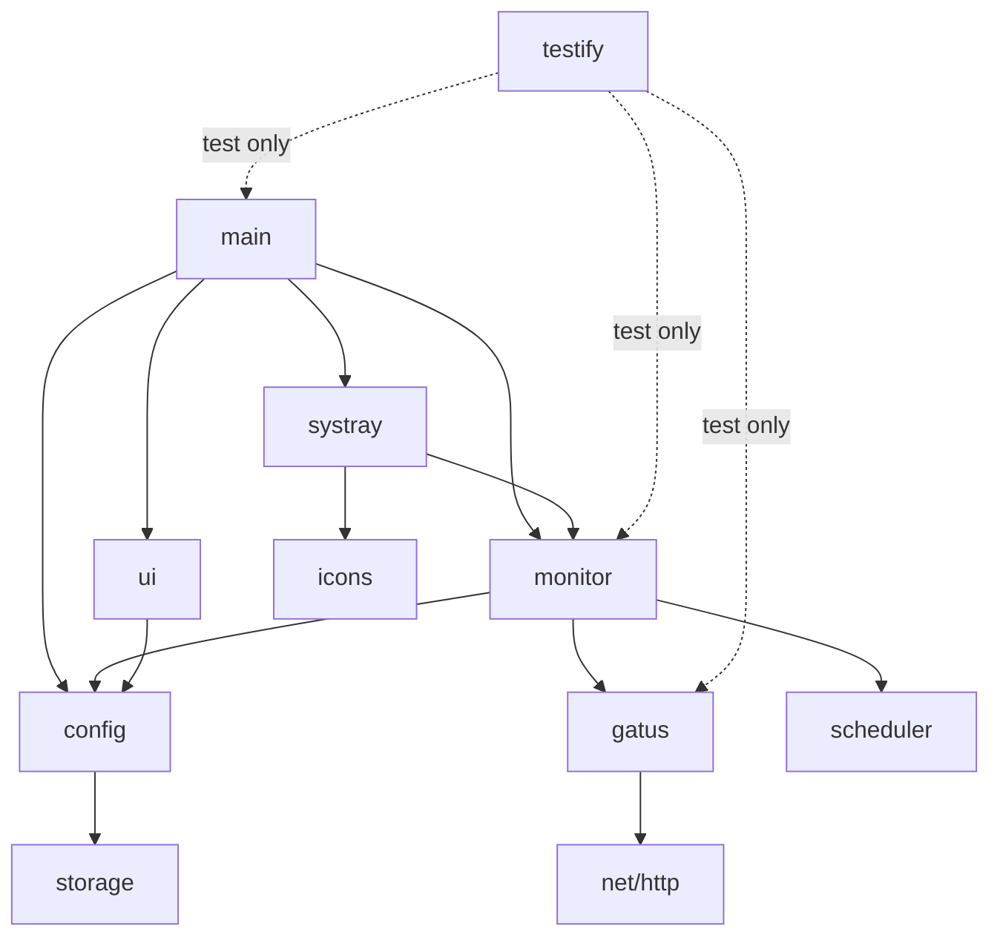

# Gatus Monitor - Package Documentation

This document provides an annotated list of all packages used in the Gatus Monitor application architecture.

## Core Application Packages

### `main`

**Location:** `cmd/gatus-monitor/main.go`
**Purpose:** Application entry point and initialization
**Responsibilities:**

- Initialize system tray
- Load configuration
- Start monitoring service
- Handle graceful shutdown
- Wire dependencies together

**Dependencies:**

- All internal packages
- `getlantern/systray` or `fyne.io/systray`

---

### `config`

**Location:** `internal/config/`
**Purpose:** Configuration management
**Responsibilities:**

- Load configuration from disk
- Save configuration to disk
- Validate configuration values
- Provide default configuration
- Determine platform-specific config paths

**Key Types:**

- `Config`: Main configuration structure
- `Validator`: Configuration validation

**Dependencies:**

- `encoding/json`
- `os`
- `path/filepath`

---

### `monitor`

**Location:** `internal/monitor/`
**Purpose:** Core monitoring orchestration
**Responsibilities:**

- Coordinate query scheduling
- Aggregate status from all endpoints
- Determine overall health status
- Notify UI of status changes
- Manage monitoring lifecycle

**Key Types:**

- `Monitor`: Main monitoring service
- `StatusAggregator`: Combines endpoint statuses

**Dependencies:**

- `config`
- `gatus`
- `scheduler`
- `time`

---

### `gatus`

**Location:** `internal/gatus/`
**Purpose:** Gatus API client
**Responsibilities:**

- Make HTTP requests to Gatus API
- Parse Gatus API responses
- Count errors in endpoint results
- Handle API errors gracefully
- Support HTTPS and certificate validation

**Key Types:**

- `Client`: HTTP client for Gatus API
- `EndpointStatus`: Parsed status from Gatus
- `APIResponse`: Raw API response structure

**Dependencies:**

- `net/http`
- `encoding/json`
- `time`
- `context`

---

### `scheduler`

**Location:** `internal/scheduler/`
**Purpose:** Query scheduling and staggering
**Responsibilities:**

- Schedule periodic queries
- Implement staggered execution
- Handle interval changes
- Manage goroutines for concurrent queries
- Cancel in-flight requests on shutdown

**Key Types:**

- `Scheduler`: Main scheduling service
- `Task`: Scheduled query task

**Dependencies:**

- `time`
- `context`
- `sync`

---

### `storage`

**Location:** `internal/storage/`
**Purpose:** Persistent data storage
**Responsibilities:**

- Determine config file location per platform
- Ensure config directory exists
- Set proper file permissions (0600)
- Handle file I/O errors

**Key Types:**

- `Storage`: File storage abstraction

**Dependencies:**

- `os`
- `path/filepath`
- `io/ioutil`

---

### `systray`

**Location:** `internal/systray/`
**Purpose:** System tray integration
**Responsibilities:**

- Create and update tray icon
- Provide menu items (Settings, Quit)
- Handle menu interactions
- Update icon based on status
- Show tooltips with status info

**Key Types:**

- `TrayApp`: System tray application
- `IconSet`: Icon resources for different states

**Dependencies:**

- `getlantern/systray` (or alternative)
- `monitor`

---

### `ui`

**Location:** `internal/ui/`
**Purpose:** Settings user interface
**Responsibilities:**

- Display settings window with responsive layout
- Allow editing of Gatus instances (name, URL, icon)
- Allow editing of query interval
- Provide inline editing without popup dialogs
- Fetch and cache instance icons
- Validate user input
- Save changes to configuration

**Key Types:**

- `SettingsWindow`: Main settings UI with split-pane layout

**UI Design:**

- Fixed header with title
- Fixed footer with Save/Cancel buttons
- Scrollable body content
- Split-pane layout for instances:
  - Left: List of instances with Edit/Remove buttons
  - Right: Inline edit panel
- No popup dialogs - all editing done inline

**Dependencies:**

- `fyne.io/fyne/v2`
- `config`
- `icons` (for fetching favicons)

---

### `icons`

**Location:** `internal/icons/`
**Purpose:** Icon management and fetching
**Responsibilities:**

- Provide green, orange, red icon data for system tray
- Embed status icons at compile time
- Fetch and cache favicons from Gatus instances
- Auto-detect icons from HTML pages
- Handle multiple icon fetch strategies

**Key Types:**

- Icon byte arrays (embedded)
- `FetchIcon()`: Auto-detect and download favicons

**Key Functions:**

- `FetchIcon(baseURL, iconURL)`: Fetches favicon using multiple strategies
- `findFaviconInHTML()`: Parses HTML to find favicon links
- `downloadIcon()`: Downloads icon with size and timeout limits

**Icon Fetch Strategies:**

1. Explicit IconURL if provided
2. Parse HTML for `<link rel="icon">` tags
3. Try common paths: /favicon.ico, /apple-touch-icon.png, /favicon.png

**Dependencies:**

- `embed`
- `net/http`
- `golang.org/x/net/html`
- `io`
- `context`

---

## Third-Party Packages

### System Tray

#### Option 1: `getlantern/systray`

**Version:** v1.2.2
**License:** Apache 2.0
**Purpose:** Cross-platform system tray support
**Why chosen:** Lightweight, pure Go, good cross-platform support
**Repository:** <https://github.com/getlantern/systray>

#### Option 2: `fyne-io/systray`

**Version:** v1.10.0
**License:** BSD-3-Clause
**Purpose:** System tray support (fork of getlantern/systray)
**Why chosen:** Maintained fork with Fyne integration
**Repository:** <https://github.com/fyne-io/systray>

---

### GUI Framework

#### `fyne.io/fyne/v2`

**Version:** v2.4.0+
**License:** BSD-3-Clause
**Purpose:** Cross-platform GUI toolkit
**Why chosen:** Native look and feel, excellent cross-platform support, easy to use
**Repository:** <https://github.com/fyne-io/fyne>
**Key features:**

- Native UI on all platforms
- Material Design support
- Accessibility built-in
- Good documentation

---

### Testing

#### `stretchr/testify`

**Version:** v1.8.4+
**License:** MIT
**Purpose:** Testing toolkit with assertions and mocks
**Why chosen:** Industry standard for Go testing
**Repository:** <https://github.com/stretchr/testify>
**Key packages:**

- `assert`: Assertion functions
- `mock`: Mocking framework
- `suite`: Test suites

---

### Build and Development

#### Go Standard Library Packages

**`net/http`**

- HTTP client for API requests
- Standard library, no external dependency

**`encoding/json`**

- JSON parsing and encoding
- Standard library

**`time`**

- Time handling and scheduling
- Standard library

**`context`**

- Request cancellation and timeouts
- Standard library

**`sync`**

- Synchronization primitives
- Standard library

**`os`**

- File system operations
- Standard library

**`path/filepath`**

- Platform-independent path handling
- Standard library

**`embed`**

- Embedding static assets
- Standard library (Go 1.16+)

---

## Development Tools (Not in Binary)

### `golangci-lint`

**Purpose:** Comprehensive Go linter
**Why chosen:** Runs multiple linters in parallel, configurable
**Configuration:** `.golangci.yml`

### `pre-commit`

**Purpose:** Git hook framework
**Why chosen:** Language-agnostic, widely used, extensible
**Configuration:** `.pre-commit-config.yaml`

### `mkdocs`

**Purpose:** Documentation site generator
**Why chosen:** Easy to use, good themes, GitHub Pages integration
**Configuration:** `mkdocs.yml`

### `mkdocs-material`

**Purpose:** Material Design theme for MkDocs
**Why chosen:** Beautiful, feature-rich, well-maintained

---

## Platform-Specific Considerations

### Linux

- System tray support via libappindicator or GTK
- XDG Base Directory specification for config location

### macOS

- System tray via Cocoa framework
- .app bundle creation requires specific structure
- Code signing for Gatekeeper

### Windows

- System tray via Windows Shell API
- MSI installer creation
- Authenticode signing for SmartScreen

---

## Package Dependency Graph

---

## Package Size Estimates

| Package | Estimated Lines of Code | Complexity |
|---------|------------------------|------------|
| `main` | 100-150 | Low |
| `config` | 150-200 | Low |
| `monitor` | 250-300 | Medium |
| `gatus` | 200-250 | Medium |
| `scheduler` | 150-200 | Medium |
| `storage` | 100-150 | Low |
| `systray` | 200-250 | Medium |
| `ui` | 300-400 | Medium-High |
| `icons` | 50-100 | Low |

**Total Estimated LOC:** ~1,500-2,000 (excluding tests)
**Test Coverage Target:** 80%+ (adds ~1,200-1,600 LOC)

---

## Version Compatibility

| Dependency | Minimum Go Version |
|------------|-------------------|
| Go standard library | 1.21 |
| fyne.io/fyne/v2 | 1.21 |
| getlantern/systray | 1.16 |
| testify | 1.16 |

**Target Go Version:** 1.21+

---

## License Summary

All third-party packages use permissive licenses compatible with MIT:

- Apache 2.0: getlantern/systray
- BSD-3-Clause: Fyne, fyne-io/systray
- MIT: testify

No copyleft (GPL) dependencies - safe for commercial use.
