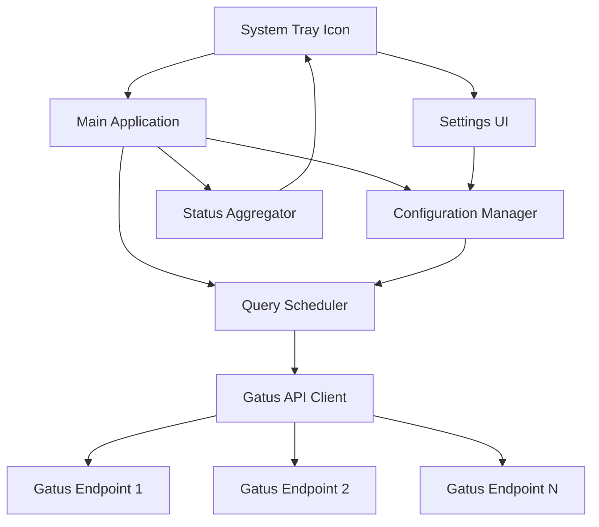
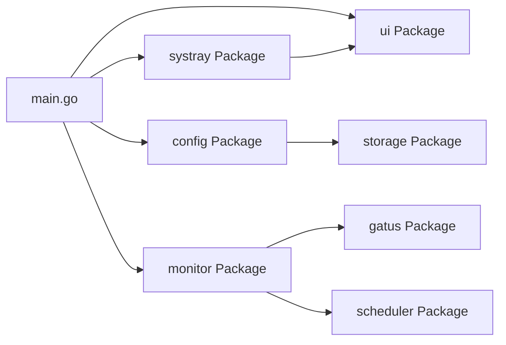

# Gatus Monitor - Technical Specification

## 1. Project Overview

**Project Name:** Gatus Monitor
**Version:** 0.1.0
**Language:** Go
**Target Platforms:** Linux, Windows, macOS
**License:** MIT (EU Compliance Required)

### 1.1 Purpose

Gatus Monitor is a cross-platform system tray application that monitors multiple Gatus health check endpoints and provides visual feedback on their status through a color-coded icon.

### 1.2 Scope

The application will:

- Run as a background system tray application
- Monitor one or more Gatus API endpoints
- Display visual status indicators based on error counts
- Provide a settings interface for configuration
- Operate with minimal resource usage
- Support cross-platform deployment

## 2. Architecture

### 2.1 High-Level Architecture



### 2.2 Component Architecture



### 2.3 Technology Stack

| Component | Technology |
|-----------|------------|
| System Tray | getlantern/systray or fyne-io/systray |
| GUI Framework | fyne.io/fyne/v2 |
| HTTP Client | net/http (standard library) |
| Configuration Storage | JSON file in user config directory |
| Build System | Go modules + Nix flake |
| Testing | Go testing package + testify |

## 3. Functional Requirements

### 3.1 User Stories

#### US-001: Configure Gatus Endpoints

**As a** DevOps engineer
**I want to** add multiple Gatus endpoint URLs to monitor
**So that** I can track the health of multiple monitoring instances

**Acceptance Criteria:**

- User can open settings panel from system tray
- User can add one or more Gatus instances with friendly names
- User can specify icon URL or auto-fetch from Gatus page
- User can edit existing instances
- User can remove instances
- URLs are validated for correct format
- Configuration persists across application restarts
- Icons are cached locally for performance

#### US-002: Configure Query Interval

**As a** user
**I want to** set the interval at which Gatus endpoints are queried
**So that** I can balance between timely updates and API rate limits

**Acceptance Criteria:**

- User can set query interval in seconds
- Default interval is 60 seconds
- Minimum interval is 10 seconds
- Maximum interval is 3600 seconds (1 hour)
- Configuration persists across application restarts

#### US-003: View System Status

**As a** user
**I want to** see the overall health status at a glance
**So that** I can quickly identify if there are any issues

**Acceptance Criteria:**

- System tray icon shows green when all endpoints have no errors
- System tray icon shows orange when any endpoint has 1-2 errors
- System tray icon shows red when any endpoint has 3+ errors
- Icon updates within one query interval of status change

#### US-004: Staggered Queries

**As a** system administrator
**I want** queries to different endpoints to be staggered
**So that** API servers are not hit simultaneously

**Acceptance Criteria:**

- Queries to different endpoints are distributed evenly across the interval
- Initial queries start at staggered times
- Staggering is maintained across query cycles

#### US-005: Application Lifecycle

**As a** user
**I want** the application to start minimized to system tray
**So that** it doesn't interrupt my workflow

**Acceptance Criteria:**

- Application starts in system tray on launch
- No window is shown on startup
- Application can be exited from system tray menu

#### US-006: Responsive Settings UI

**As a** user
**I want** the settings UI to be responsive and well-organized
**So that** I can easily configure the application

**Acceptance Criteria:**

- Settings window has fixed header with title
- Settings window has fixed footer with action buttons
- Main content area is scrollable if content overflows
- UI follows standard desktop application layout patterns
- All elements are accessible and properly sized

### 3.2 Business Rules

#### BR-001: Error Counting

- Errors are counted per endpoint per query cycle
- Error count resets with each new query
- Only errors from the most recent query cycle affect icon color

#### BR-002: Status Priority

- Red status takes priority over orange and green
- Orange status takes priority over green
- If any endpoint is red, overall status is red
- If no endpoints are red but any is orange, overall status is orange
- Only if all endpoints are green is overall status green

#### BR-003: Query Timing

- First query happens immediately on startup
- Subsequent queries occur at configured interval
- Failed queries are retried on next interval (no immediate retry)
- Stagger offset = (interval / number_of_endpoints)

#### BR-004: Configuration Storage

- Configuration stored in platform-specific user config directory
  - Linux: `~/.config/gatus-monitor/config.json`
  - macOS: `~/Library/Application Support/gatus-monitor/config.json`
  - Windows: `%APPDATA%\gatus-monitor\config.json`
- Invalid configurations fall back to defaults
- Configuration changes take effect on next query cycle

#### BR-005: Icon Fetching and Caching

- Icons are fetched automatically when instance URL is provided
- Icon fetch attempts multiple strategies:
  1. Explicit IconURL if provided
  2. Favicon link tags in HTML `<head>`
  3. Common favicon paths (/favicon.ico, /apple-touch-icon.png, /favicon.png)
- Fetched icons are cached in IconData field to avoid repeated downloads
- Icons are only re-fetched if URL or IconURL changes
- Icon fetch failures are logged but not fatal (instances work without icons)
- Maximum icon size: 1MB
- Fetch timeout: 10 seconds

#### BR-006: UI/UX Design Principles

- Responsive layout with fixed header and footer, scrollable body
- Popup dialogs avoided - prefer inline editing in main work area
- Settings UI uses split-pane layout:
  - Left pane: List of instances
  - Right pane: Edit panel for selected instance
- All user operations complete in the same window context
- Error messages displayed inline, not as popup dialogs
- Footer attribution: "Made with 💗 by Kartoza | Donate! | GitHub" with clickable links
  - Kartoza links to <https://kartoza.com>
  - Donate links to <https://github.com/sponsors/kartoza>
  - GitHub links to <https://github.com/kartoza/gatus-monitor>
- Attribution must appear in:
  - Settings panel footer
  - README.md Credits section
  - MkDocs landing page (docs/index.md)
  - MkDocs footer (mkdocs.yml copyright)
  - GitHub release notes
  - Package descriptions and metadata where applicable

### 3.3 Non-Functional Requirements

#### NFR-001: Performance

- Application memory usage < 50MB under normal operation
- CPU usage < 1% when idle
- Query response time < 5 seconds per endpoint
- UI operations complete within 100ms

#### NFR-002: Reliability

- Application recovers from network failures
- Application handles malformed API responses gracefully
- Application continues operation if one endpoint is unreachable
- Configuration errors are reported to user without crashing

#### NFR-003: Security

- No sensitive data logged to disk
- HTTPS connections verify certificates
- Configuration file has restrictive permissions (0600)
- No plain-text password storage (if authentication added later)

#### NFR-004: Usability

- Settings panel is intuitive and requires no documentation
- System tray icon tooltips explain current status
- Error messages are clear and actionable

#### NFR-005: Maintainability

- Code coverage > 80%
- All public functions documented with godoc
- Code passes all linters (golangci-lint)
- Follows Go community standards

## 4. API Integration

### 4.1 Gatus API Endpoints

The application will query the Gatus API:

```
GET https://<gatus-url>/api/v1/endpoints/statuses
```

Expected response structure:

```json
{
  "endpoints": [
    {
      "name": "service-name",
      "group": "group-name",
      "results": [
        {
          "success": true,
          "timestamp": "2026-02-28T00:00:00Z",
          "errors": []
        }
      ]
    }
  ]
}
```

### 4.2 Error Detection Logic

An endpoint is considered to have errors if:

- `results[0].success == false`
- `len(results[0].errors) > 0`
- HTTP request fails (timeout, connection refused, etc.)
- Response is malformed JSON

Error count per endpoint = number of failed services in that Gatus instance

## 5. Data Models

### 5.1 Configuration

```go
type GatusInstance struct {
    Name     string `json:"name"`      // Friendly name for this instance
    URL      string `json:"url"`       // URL to the Gatus landing page
    IconURL  string `json:"icon_url"`  // URL to the icon (favicon from monitored site)
    IconData []byte `json:"icon_data"` // Cached icon data
}

type Config struct {
    QueryInterval int              `json:"query_interval"` // seconds, default 60
    GatusURLs     []string         `json:"gatus_urls"`     // DEPRECATED: Legacy field
    Instances     []GatusInstance  `json:"instances"`      // Gatus instances with metadata
}
```

**Legacy Configuration Migration:**

- Old configs with `GatusURLs` are automatically migrated to `Instances` on load
- Migration creates default names like "Gatus 1", "Gatus 2", etc.
- `GatusURLs` field is cleared after successful migration

### 5.2 Endpoint Status

```go
type EndpointStatus struct {
    URL          string
    ErrorCount   int
    LastChecked  time.Time
    LastError    error
    Reachable    bool
}
```

### 5.3 Overall Status

```go
type OverallStatus int

const (
    StatusGreen  OverallStatus = iota // 0 errors across all endpoints
    StatusOrange                      // 1-2 errors across any endpoint
    StatusRed                         // 3+ errors on any endpoint
)
```

## 6. Testing Requirements

### 6.1 Unit Tests

- All packages must have unit tests
- Minimum 80% code coverage
- Mock external API calls
- Test error conditions

### 6.2 Integration Tests

- Test full query cycle
- Test configuration persistence
- Test UI interactions
- Test cross-platform builds

### 6.3 End-to-End Tests

- Test with real Gatus instance
- Test multi-endpoint scenarios
- Test network failure recovery
- Test configuration changes during runtime

### 6.4 Performance Tests

- Memory usage under extended operation
- CPU usage during queries
- Response time to status changes

## 7. Build and Deployment

### 7.1 Build Targets

| Platform | Architecture | Output |
|----------|--------------|--------|
| Linux | amd64 | Binary, .deb, .rpm, AppImage, Flatpak, Snap |
| Linux | arm64 | Binary, .deb, .rpm |
| macOS | amd64 | Binary, .app bundle, .dmg |
| macOS | arm64 (Apple Silicon) | Binary, .app bundle, .dmg |
| Windows | amd64 | Binary, .exe, MSI installer |

### 7.2 Release Process

- Semantic versioning (MAJOR.MINOR.PATCH)
- Automated builds via GitHub Actions on tag push (v*)
- Cross-platform builds using native runners:
  - Linux: ubuntu-latest (amd64, arm64 with cross-compiler)
  - macOS: macos-latest (amd64, arm64, universal binary, DMG)
  - Windows: windows-latest (amd64, GUI mode binary)
- macOS app bundle created with fyne package tool
- Checksums generated for all artifacts (SHA256)
- Release notes auto-generated from commit messages
- Release page includes installation instructions for all platforms

### 7.3 Dependencies

- Managed via Go modules
- Nix flake for development environment
- Pinned versions for reproducible builds

## 8. Documentation Requirements

### 8.1 User Documentation

- Installation guide per platform
- Quick start guide
- Configuration reference
- Troubleshooting guide
- FAQ

### 8.2 Administrator Documentation

- Deployment options
- Configuration management
- Monitoring and logging
- Security considerations

### 8.3 Developer Documentation

- Architecture overview
- API documentation (godoc)
- Build instructions
- Contributing guidelines
- Code style guide

## 9. Security Considerations

### 9.1 Authentication

- Support for Gatus instances with authentication (future enhancement)
- Secure storage of credentials if needed

### 9.2 Network Security

- TLS certificate validation
- Timeout for all HTTP requests (30 seconds)
- No proxy credential storage

### 9.3 Data Privacy

- No telemetry or analytics
- No data sent to third parties
- Configuration stays local

## 10. Future Enhancements

### 10.1 Planned Features (Not in v1.0)

- Desktop notifications for status changes
- Detailed status view (not just tray icon)
- Log viewer for historical status
- Export status data to CSV/JSON
- Dark mode support
- Authentication support for Gatus endpoints
- Configurable alert thresholds
- Sound alerts

### 10.2 Potential Integrations

- Slack/Discord notifications
- Prometheus metrics export
- PagerDuty integration
- Email alerts

## 11. Compliance

### 11.1 License Compliance

- EU GDPR compliant (no personal data collection)
- Open source license (MIT)
- Third-party license attribution
- License header in all source files

### 11.2 Accessibility

- Keyboard navigation in settings UI
- Screen reader support (where platform supports)
- High contrast icon options

## 12. Success Criteria

The project is considered successful when:

1. Application builds on all target platforms
2. All unit tests pass with >80% coverage
3. Integration tests pass on all platforms
4. User can configure and monitor multiple Gatus endpoints
5. Status updates occur reliably at configured interval
6. Application uses <50MB RAM and <1% CPU when idle
7. Documentation is complete and published
8. Pre-commit hooks and CI/CD are functional
9. First release is published with all platform packages
